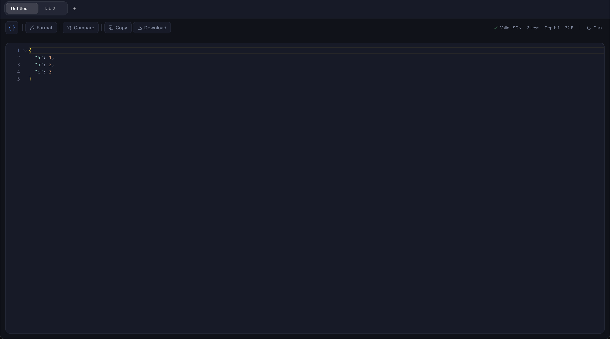

# JSON Formatter

> A blazing fast, modern, and privacy-focused JSON formatter & validator built with React, Monaco Editor, and a beautiful glassmorphism UI.


## Highlights

*   **Glassmorphism Design:** A stunning macOS-inspired liquid glass UI with blur effects, smooth transitions, and a premium aesthetic.
*   **Blazing Fast:** Optimized for speed with React.memo, useCallback, and a streamlined architecture. Loads instantly and handles large JSON files with ease.
*   **Privacy Focused:** 100% client-side. Your data never leaves your browser. Works offline.
*   **Powerful Editor:** Built on Monaco Editor (VS Code) for a familiar and robust editing experience.
*   **Feature Rich:**
    *   **JSON Validation:** Instant, precise error reporting with line numbers and suggestions.
    *   **Tab System:** Manage multiple JSON files simultaneously with a Safari-style tab bar.
    *   **Diff / Compare:** Visual side-by-side comparison of JSON structures.
    *   **Local Storage Sync:** Your work is automatically saved and restored.

## Tech Stack

*   **Core:** React 18, TypeScript, Vite
*   **Styling:** Tailwind CSS, Tailwind Animate, Lucide React
*   **Editor:** Monaco Editor
*   **State:** Custom Hooks (LocalStorage) & React State
*   **UI Components:** Radix UI (shadcn/ui flavor)
*   **Testing:** Vitest, React Testing Library

## Installation & Setup

1.  **Clone the repository**

2.  **Install dependencies**
    ```bash
    npm install
    # or
    yarn install
    # or
    pnpm install
    ```

3.  **Start the development server**
    ```bash
    npm run dev
    ```

4.  **Build for production**
    ```bash
    npm run build
    ```

## Contributing

Contributions are welcome! Please feel free to submit a Pull Request.

## License

This project is open-source and available under the [MIT License](LICENSE).
