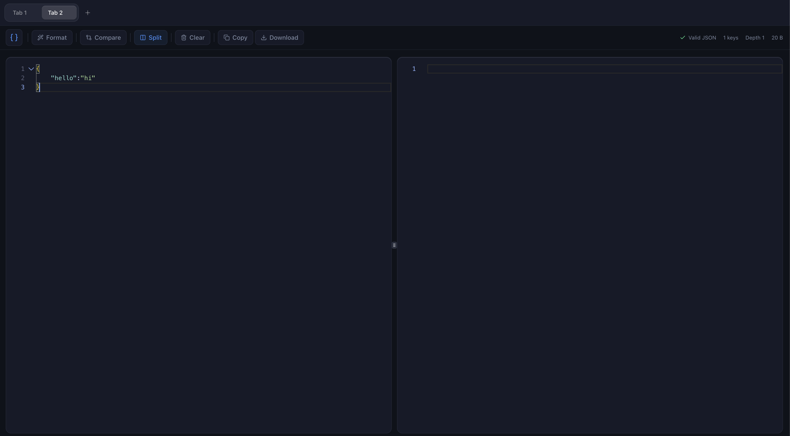

# JSON Formatter

> A blazing fast, modern, and privacy-focused JSON formatter & validator built with React, Monaco Editor, and a beautiful glassmorphism UI.



## Features

- **Advanced JSON Formatting**: Automatic indentation, syntax highlighting, and error validation.
- **Side-by-Side Comparison**: Visually compare two JSON structures with detailed diff highlighting.
- **Split View Editor**: Dual-pane editing environment for multitasking with independent controls.
- **Intelligent Tab System**: Manage multiple JSON contexts simultaneously with persistent state.
- **Privacy-First Architecture**: All processing happens client-side; data never leaves the browser.
- **Productivity Tools**: One-click copy, file download, minification, and format controls.
- **Modern Interface**: Clean, dark-themed UI with glassmorphism design for optimal readability.

## Tech Stack

*   **Core:** React 18, TypeScript, Vite
*   **Styling:** Tailwind CSS, Tailwind Animate, Lucide React
*   **Editor:** Monaco Editor
*   **State:** Custom Hooks (LocalStorage) & React State
*   **UI Components:** Radix UI (shadcn/ui flavor)
*   **Testing:** Vitest, React Testing Library

## Installation & Setup

1.  **Clone the repository**
    ```bash
    git clone https://github.com/Naveenv01/Jsonmate.git
    ```

2.  **Install dependencies**
    ```bash
    npm install
    # or
    yarn install
    # or
    pnpm install
    ```

3.  **Start the development server**
    ```bash
    npm run dev
    ```

4.  **Build for production**
    ```bash
    npm run build
    ```

## Contributing

Contributions are welcome! Please feel free to submit a Pull Request.

## License

This project is open-source and available under the [MIT License](LICENSE).
